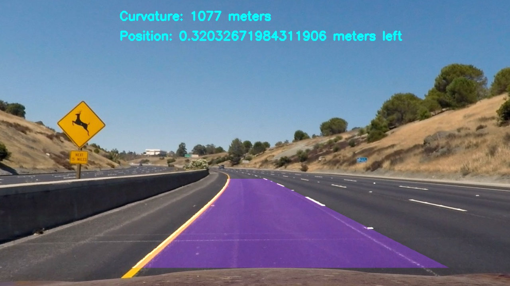

## Advanced lane finding

---

**Advanced Lane Finding Project**

The goals / steps of this project are the following:

* Compute the camera calibration matrix and distortion coefficients given a set of chessboard images.
* Apply a distortion correction to raw images.
* Use color transforms, gradients, etc., to create a thresholded binary image.
* Apply a perspective transform to rectify binary image ("birds-eye view").
* Detect lane pixels and fit to find the lane boundary.
* Determine the curvature of the lane and vehicle position with respect to center.
* Warp the detected lane boundaries back onto the original image.
* Output visual display of the lane boundaries and numerical estimation of lane curvature and vehicle position.

[//]: # (Image References)

[image1]: ./output_images/Image0_text.jpg "Result"
[image2]: ./output_images/Image0_undistorted.jpg "Undistorted"
[image3]: ./output_images/Image0_original.jpg "Original"
[image4]: ./output_images/Image0_warped.jpg "Transformed"
[image5]: ./output_images/Image0_colored.jpg "Colored"
[image6]: ./output_images/Image0_transformed.jpg "Lane in Birdseye"
[image7]: ./output_images/Image0_result.jpg "Lane in Birdseye"
[image7]: ./output_images/Image0_position.jpg "Lane in Birdseye"

## Example resulting image
![alt text][image1]

---

### Camera Calibration

The camera matrix was generated from a set of chessboard images taken with the camera that was used to record the drive. This way the camera matrix could be used to undistort each frame and ensure that the curvature readings were accurate. The calculations for the camera matrix and the undistort function can be found in the src/calibrate.py function. The class is initialized becore the video is begun so that the inital calibration is done prior to any line finding calculations. 

#### Original Image
![Original Image][image3]
#### Undistorted Image
![Undistorted Image][image2]

### Pipeline

#### Image warp

After the image was undistorted the image was warped into a birds eye view. This was done by taking points from the rough locations of where the lane was likely to be and then finding a mapping in which those coordinates formed a rectangle. Once this mapping was found it was applied to all pixels in the image to create a birds eye view of the lane.

![Transformed][image4]

#### 2. Binary Image

To extract the lane lines the birds eye view was transformed into a binary image. This was done purely based on color channels from the LAB and LUV color spaces of the image. These provided the best extraction of the lane colors. 

![Recolored image][image5]

#### 3. Lane information extraction

A polynomal function was then fit on the coordinates of the 'on' pixels in the image. This was done by collecting pixels that were in the correct spot. To do this we defined a rectangular box for each of lane in ten spots in the birds eye views vertical direction. pixels not in the boxes were discarded and a polynomial for each line was fit to remaining points. This functions were used to determine the lane, and later on the curvature and position of the car

![alt text][image6]

### 4. Unwarping

This new image was then warped back into the same coordinate system as the undistorted image and the two images were merged together. 

![alt text][image7]

### 5. Calculations

The curvature and position of the car were then calculated and added to the image
- curvature was calculated based on the polynomial of each lane line and then the two curvaturs were averaged. 
- position was calculated based on the diffence between the lane center and the image center and then converted to world space.

![alt text][image8]

![alt text][image1]

---

### Pipeline (video)

A video was created by running each frame from a video through the pipeline. 

#### 1.Result as a video

Here's a [link to my video result](https://youtu.be/JOPVBjE40CU)

---

### Discussion

#### 1. Briefly discuss any problems / issues you faced in your implementation of this project.  Where will your pipeline likely fail?  What could you do to make it more robust?

Here I'll talk about the approach I took, what techniques I used, what worked and why, where the pipeline might fail and how I might improve it if I were going to pursue this project further.  
